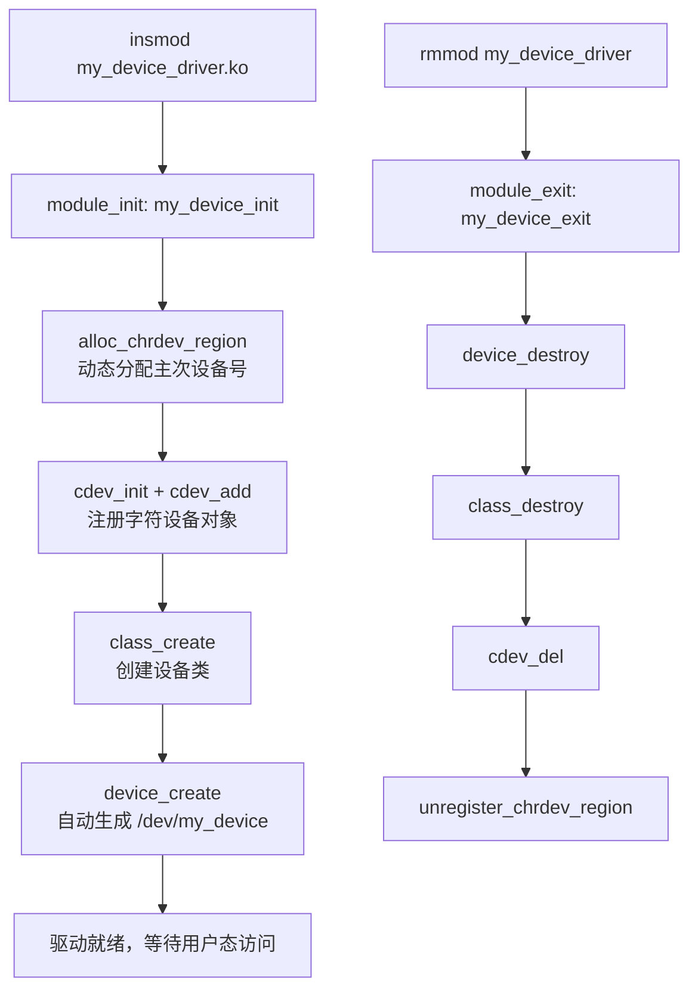
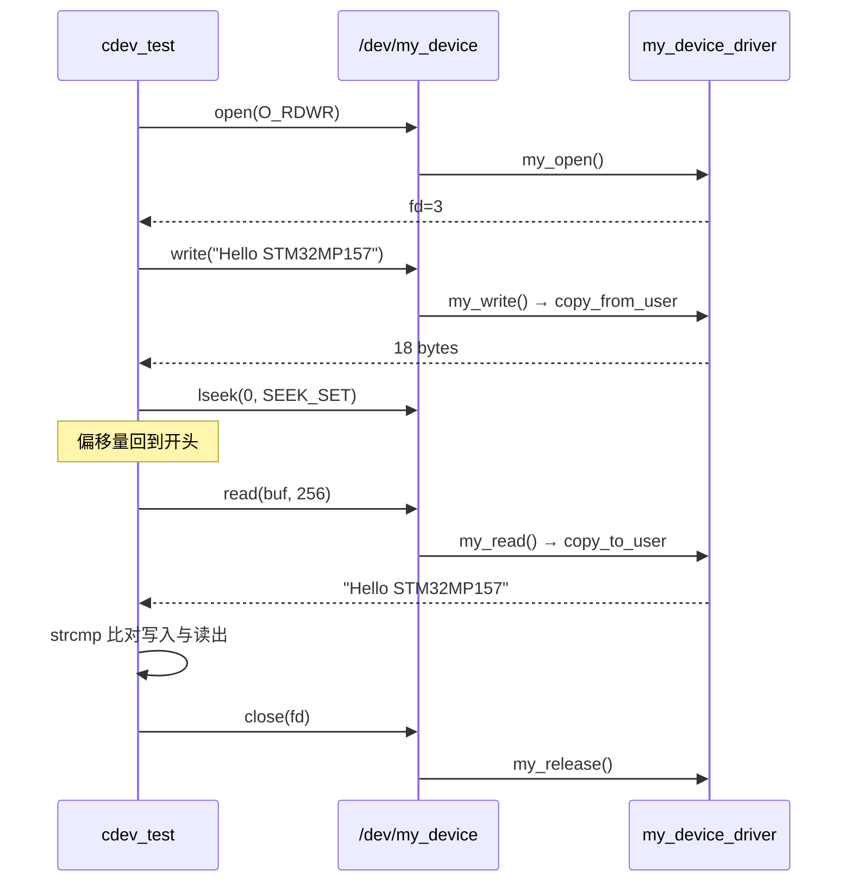

# 阶段一：字符设备驱动学习笔记

> **平台**：STM32MP157（LubanCat）  
> **内核版本**：Linux 4.19  
> **日期**：2026-06-23  
> **关联源码**：`driver_code/my_device_driver.c`、`app_code/cdev_test.c`

---

## 1. 学习目标

完成本阶段后，你应能回答以下问题：

- 什么是字符设备？它与块设备有何区别？
- 内核驱动如何从注册到生成 `/dev/my_device` 节点？
- `file_operations` 中 `open / read / write / release` 分别在何时被调用？
- 用户态 `write()` 的数据如何安全地进入内核缓冲区？
- 如何用 `cdev_test` 验证整条驱动链路？

---

## 2. 背景知识

### 2.1 Linux 设备分类

| 类型 | 特点 | 典型例子 |
|------|------|----------|
| **字符设备** | 按字节流顺序访问，不支持随机寻址（或寻址能力有限） | 串口、GPIO、LED、自定义驱动 |
| **块设备** | 按固定大小块访问，支持随机读写 | eMMC、SD 卡、U 盘 |
| **网络设备** | 面向数据包收发 | eth0、wlan0 |

本实验属于 **字符设备驱动**，用户通过 `/dev/my_device` 文件进行读写。

### 2.2 "一切皆文件"

Linux 将硬件抽象为文件系统中的节点：

```
用户程序  open("/dev/my_device")
    ↓
VFS（虚拟文件系统）
    ↓
file_operations 函数指针
    ↓
驱动代码 my_read / my_write
    ↓
内核缓冲区 device_buffer[]
```

用户态看到的 `/dev/my_device` 只是一个入口，真正干活的是内核里的驱动函数。

### 2.3 主次设备号

每个字符设备由两个号码标识：

| 号码 | 含义 | 本实验示例 |
|------|------|------------|
| **主设备号 (major)** | 标识驱动类型，内核据此找到对应驱动 | `243`（动态分配） |
| **次设备号 (minor)** | 同一驱动下的具体设备实例 | `0` |

设备节点类型可通过 `ls -l` 查看，`c` 表示字符设备：

```
crw-rw---- 1 root root 243, 0  /dev/my_device
 ↑                    ↑  ↑
 字符设备            major minor
```

---

## 3. 驱动注册完整流程

### 3.1 流程图



### 3.2 四步注册详解

#### 第一步：分配设备号 — `alloc_chrdev_region()`

```c
ret = alloc_chrdev_region(&dev_num, 0, 1, DEVICE_NAME);
```

| 参数 | 含义 |
|------|------|
| `&dev_num` | 输出：分配到的 `dev_t`（主次设备号合并值） |
| `0` | 次设备号起始值 |
| `1` | 申请 1 个设备 |
| `DEVICE_NAME` | 设备名称，出现在 `/proc/devices` |

**动态分配 vs 静态分配：**

| 方式 | 函数 | 适用场景 |
|------|------|----------|
| 动态 | `alloc_chrdev_region()` | 学习/实验，无需预知 major 号 |
| 静态 | `register_chrdev_region()` | 产品化，major 号固定 |

#### 第二步：注册 cdev — `cdev_init()` + `cdev_add()`

```c
cdev_init(&my_cdev, &my_fops);   // 绑定 file_operations
my_cdev.owner = THIS_MODULE;
ret = cdev_add(&my_cdev, dev_num, 1);  // 向内核注册
```

`struct cdev` 是字符设备的内核对象，将 **设备号** 与 **操作函数集** 关联起来。

#### 第三步：创建设备类 — `class_create()`

```c
dev_class = class_create(THIS_MODULE, CLASS_NAME);
```

在 sysfs 中创建 `/sys/class/my_device_class/`，用于设备管理。

#### 第四步：创建设备节点 — `device_create()`

```c
dev_device = device_create(dev_class, NULL, dev_num, NULL, DEVICE_NAME);
```

内核自动在 `/dev/` 下生成 `my_device` 节点，**无需手动 `mknod`**。

### 3.3 卸载顺序（与注册严格相反）

```c
device_destroy(dev_class, dev_num);       // 删除 /dev/my_device
class_destroy(dev_class);                 // 删除设备类
cdev_del(&my_cdev);                       // 注销 cdev
unregister_chrdev_region(dev_num, 1);   // 释放设备号
```

> **原则**：先创建的后销毁，避免资源泄漏或内核崩溃。

---

## 4. file_operations 详解

### 4.1 结构体定义

```c
static const struct file_operations my_fops = {
    .owner   = THIS_MODULE,
    .open    = my_open,
    .read    = my_read,
    .write   = my_write,
    .release = my_release,
};
```

| 成员 | 用户态对应操作 | 调用时机 |
|------|----------------|----------|
| `open` | `open("/dev/my_device", O_RDWR)` | 打开设备 |
| `read` | `read(fd, buf, len)` | 从设备读数据 |
| `write` | `write(fd, buf, len)` | 向设备写数据 |
| `release` | `close(fd)` | 关闭设备（不是 `close` 而是 `release`） |

### 4.2 open — 打开设备

```c
static int my_open(struct inode *inode, struct file *file)
{
    open_count++;
    printk(KERN_INFO "[my_device] open(): device opened\n");
    return 0;   // 返回 0 表示成功，负值表示错误码
}
```

- `inode`：索引节点，包含设备号信息
- `file`：文件对象，代表本次打开会话
- 返回值 `0` = 成功，负值 = 错误（如 `-EBUSY`）

### 4.3 read — 内核 → 用户

```c
static ssize_t my_read(struct file *file, char __user *buf, size_t count, loff_t *ppos)
```

| 参数 | 含义 |
|------|------|
| `buf` | 用户空间缓冲区指针（**不能直接访问**） |
| `count` | 用户请求读取的字节数 |
| `ppos` | 文件偏移量指针，读完后需更新 |

**关键规则：内核不能直接访问用户空间指针，必须使用 `copy_to_user()`：**

```c
copy_to_user(buf, device_buffer + *ppos, read_len);
```

| 函数 | 方向 | 说明 |
|------|------|------|
| `copy_to_user()` | 内核 → 用户 | read 中使用 |
| `copy_from_user()` | 用户 → 内核 | write 中使用 |

直接解引用 `buf` 会导致内核崩溃或安全漏洞。

**返回值：**

| 返回值 | 含义 |
|--------|------|
| `> 0` | 实际读取的字节数 |
| `0` | 已到文件末尾（EOF） |
| `< 0` | 错误码（如 `-EFAULT`） |

### 4.4 write — 用户 → 内核

```c
static ssize_t my_write(struct file *file, const char __user *buf, size_t count, loff_t *ppos)
{
    copy_from_user(device_buffer + *ppos, buf, write_len);
    *ppos += write_len;
    if (*ppos > buffer_len)
        buffer_len = *ppos;
    return write_len;
}
```

数据从用户缓冲区拷贝到内核 `device_buffer[]`，并更新有效数据长度 `buffer_len`。

### 4.5 release — 关闭设备

```c
static int my_release(struct inode *inode, struct file *file)
{
    open_count--;
    return 0;
}
```

对应用户态 `close(fd)`。注意函数名是 `release` 而非 `close`，因为 `close` 是 VFS 层概念。

---

## 5. 内核关键数据结构

```c
static dev_t dev_num;              // 主次设备号（dev_t 类型）
static struct cdev my_cdev;        // 字符设备内核对象
static struct class *dev_class;    // 设备类（sysfs 管理）
static struct device *dev_device;  // 设备实例（/dev 节点）

static char device_buffer[BUFFER_SIZE];  // 内核数据缓冲区
static int buffer_len;                    // 缓冲区有效数据长度
static int open_count;                    // 当前打开次数
static DEFINE_MUTEX(device_mutex);        // 互斥锁，保护并发访问
```

### 互斥锁的作用

多个进程同时 open 同一设备时，`read/write` 可能并发执行。`mutex_lock/unlock` 保证同一时刻只有一个进程访问 `device_buffer`，避免数据错乱。

---

## 6. 用户态测试程序

### 6.1 源码位置

`app_code/cdev_test.c` → 编译产物 `cdev_test`

### 6.2 测试流程



### 6.3 关键代码说明

```c
// 1. 打开设备（触发驱动 my_open）
fd = open(DEVICE_PATH, O_RDWR);

// 2. 写入字符串（触发驱动 my_write）
write(fd, write_msg, strlen(write_msg));

// 3. 偏移量回到 0（否则 read 从末尾开始，读不到数据）
lseek(fd, 0, SEEK_SET);

// 4. 读回数据（触发驱动 my_read）
read(fd, read_buf, sizeof(read_buf) - 1);

// 5. 比对验证
strcmp(write_msg, read_buf) == 0  →  [PASS]

// 6. 关闭（触发驱动 my_release）
close(fd);
```

> **为什么需要 `lseek`？**  
> write 后 `ppos` 指向数据末尾，直接 read 会从末尾读，返回 0 字节。`lseek(fd, 0, SEEK_SET)` 将偏移量重置到开头。

---

## 7. 编译与部署

### 7.1 环境准备（Ubuntu 主机）

```bash
# 交叉编译器加入 PATH
export PATH="/opt/toolchain/gcc-arm-9.2-2019.12-x86_64-arm-none-linux-gnueabihf/bin:$PATH"
```

### 7.2 编译驱动模块

```bash
cd ~/Desktop/Embedded-Linux-Journey/driver_code
make clean && make deploy
# 产物：hello_driver.ko、my_device_driver.ko → ~/nfs_rootfs/
```

### 7.3 编译用户态测试程序

```bash
cd ~/Desktop/Embedded-Linux-Journey/app_code
make cdev_test && make deploy
# 产物：cdev_test → ~/nfs_rootfs/
```

### 7.4 驱动 Makefile 要点

```makefile
obj-m += my_device_driver.o          # 告诉 kbuild 编译此模块
KDIR ?= /home/work/system/linux      # 内核源码树路径
ARCH = arm
CROSS_COMPILE = arm-none-linux-gnueabihf-
```

编译命令本质是：

```bash
make -C $KDIR M=$(pwd) modules ARCH=arm CROSS_COMPILE=arm-none-linux-gnueabihf-
```

- `-C $KDIR`：进入内核源码树
- `M=$(pwd)`：指定外部模块路径（out-of-tree 编译）

---

## 8. 开发板测试步骤

### 8.1 完整操作流程

```bash
# === 第一步：加载驱动 ===
sudo insmod /mnt/my_device_driver.ko

# === 第二步：确认加载成功 ===
dmesg | tail -8
# 预期输出：
#   [my_device] driver loaded
#   [my_device] major=243, minor=0
#   [my_device] device node: /dev/my_device

ls -l /dev/my_device
# 预期：crw-rw---- 1 root root 243, 0  /dev/my_device

# === 第三步：运行用户态测试（需要 sudo，见 8.2） ===
sudo /mnt/cdev_test "Hello STM32MP157"
# 预期输出：
#   [INFO] open /dev/my_device success
#   [INFO] write 18 bytes: "Hello STM32MP157"
#   [INFO] read 18 bytes: "Hello STM32MP157"
#   [PASS] write/read data match!

# === 第四步：查看驱动日志 ===
sudo dmesg | tail -8
# 预期：
#   [my_device] open(): device opened
#   [my_device] write(): 18 bytes
#   [my_device] read(): 18 bytes
#   [my_device] release(): device closed

# === 第五步：卸载驱动 ===
sudo rmmod my_device_driver
ls /dev/my_device    # 节点应已消失
```

### 8.2 权限问题

`/dev/my_device` 默认权限为 `crw-rw----`（仅 root 可访问），普通用户运行会报：

```
[ERROR] open /dev/my_device failed: Permission denied
```

**解决方法：**

```bash
sudo /mnt/cdev_test "Hello STM32MP157"    # 推荐
# 或
sudo chmod 666 /dev/my_device             # 临时放开（rmmod/insmod 后需重做）
```

---

## 9. 常见问题排查

| 现象 | 可能原因 | 解决方法 |
|------|----------|----------|
| `insmod: ERROR: could not insert module` | 架构/内核版本不匹配 | 确认 `.ko` 用开发板对应内核编译 |
| `open: No such file or directory` | 驱动未加载或节点未创建 | `sudo insmod my_device_driver.ko` |
| `open: Permission denied` | 权限不足 | 使用 `sudo` 运行测试程序 |
| `rmmod: Module is not currently loaded` | 模块未加载就执行卸载 | 先 `insmod` 再 `rmmod` |
| `taints kernel` 警告 | 加载了树外模块 | 学习阶段正常，可忽略 |
| `no symbol version for module_layout` | 缺少 `Module.symvers` | 在内核树执行 `modules_prepare` |
| read 返回 0 字节 | write 后未 lseek 回开头 | 测试程序中 `lseek(fd, 0, SEEK_SET)` |

---

## 10. 内核态 vs 用户态对比

| 对比项 | 用户态（cdev_test） | 内核态（my_device_driver） |
|--------|---------------------|----------------------------|
| 运行空间 | 用户空间 | 内核空间 |
| 权限 | 受限，不能访问硬件寄存器 | 最高权限，可直接操作硬件 |
| 出错后果 | 进程崩溃 | 内核 panic / oops |
| 内存访问 | 只能访问自己的地址空间 | 通过 `copy_to/from_user` 与用户交换数据 |
| 调试输出 | `printf` | `printk`（输出到 `dmesg`） |
| 头文件 | `<stdio.h>`, `<fcntl.h>` | `<linux/module.h>`, `<linux/fs.h>` |
| 编译方式 | 交叉 gcc 直接编译 | kbuild 外部模块编译 |

---

## 11. 阶段一总结

本阶段完成了字符设备驱动的 **最小可用模板**：

```
✅ 动态分配主次设备号（alloc_chrdev_region）
✅ 注册 cdev 对象（cdev_init + cdev_add）
✅ 自动创建 /dev/my_device（class_create + device_create）
✅ 实现 file_operations（open / read / write / release）
✅ 用户态 ↔ 内核态数据交换（copy_to_user / copy_from_user）
✅ 并发保护（mutex）
✅ 配套用户态测试程序验证
```

---

## 12. 下一阶段预告

| 阶段 | 内容 |
|------|------|
| **阶段二** | `ioctl` 自定义命令（如清空缓冲区、获取状态） |
| **阶段三** | 硬件驱动（GPIO / LED / 按键真实硬件操作） |
| **阶段四** | 设备树（Device Tree）与平台设备 `platform_driver` |
| **阶段五** | 中断处理（IRQ）与等待队列（wait_queue） |

---

## 附录：源码文件索引

| 文件 | 说明 |
|------|------|
| `driver_code/my_device_driver.c` | 字符设备驱动源码 |
| `driver_code/hello_driver.c` | Hello World 入门模块 |
| `driver_code/Makefile` | 驱动编译与部署 |
| `app_code/cdev_test.c` | 用户态测试程序 |
| `app_code/main.c` | LED sysfs 控制（应用层） |
| `app_code/key_test.c` | 按键 Input 子系统监听 |
